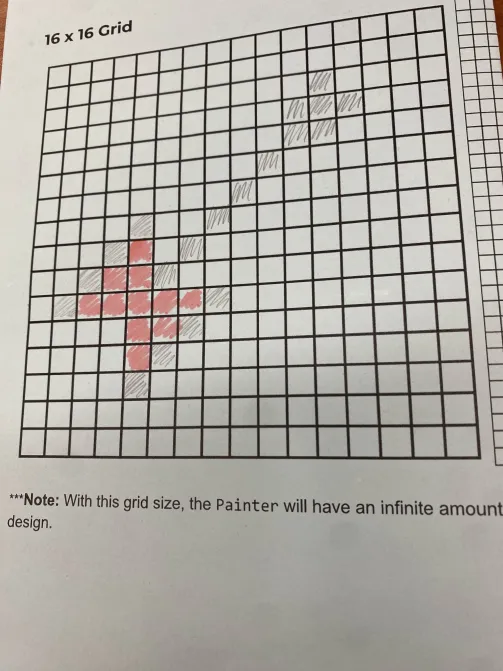
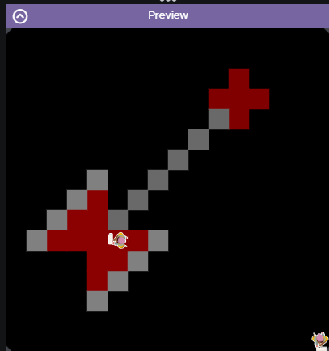

# Unit-1-Asphalt-Art-Project
Asphalt Art Project for APCSA Period 2
# Unit 1 - Asphalt Art

## Introduction

Cities use asphalt art to improve public safety, inspire their residents and visitors, and brighten communities. Your goal is to create asphalt art to revitalize The Neighborhood and bring the community together with the help of the Painter.

## Requirements

Use your knowledge of object-oriented programming, algorithms, the problem solving process, and decomposition strategies to create asphalt art:
- **Create a new subclass** – Create at least one new subclass of the PainterPlus class that is used for a component of the asphalt art design.
- **Plan an algorithm** – Use the problem solving process and decomposition strategies to plan an algorithm that incorporates a combination of sequencing, selection, and/or iteration.
- **Write a method** – Write at least one method in a PainterPlus subclass that contributes to a component of the asphalt art design.
- **Document your code** – Use comments to explain the purpose of the methods and code segments.

## Notes: Neighborhood & Painter Class

This project was created on Code.org's JavaLab platform using the built in Neightborhood GUI output. To test and edit this project you must build in Code.org's JavaLab with the Neighborhood GUI enabled. For reference to the Painter class documentation, [you can read more here.](https://studio.code.org/docs/ide/javalab/classes/Painter)

## Output:

## Reflection

1. Describe your project.

   - My project is supposed to be an image of Marceline's axe bass guitar. I think the reason I chose to paint this image was because of how important music and the TV shows I grew up with are to me. Marceline is the perfect way to represent that, as she is, one of if not, my favorite character in Adventure Time and she is a musican.

2. What are two things about your project that you are proud of?

   - I am proud that my project doesn't look as ugly as I imagined it to be, I did way better than I thought I would do. Another thing I am proud of is the colors, I had a hard time choosing what colors to use because I couldn't really find colors that would had the right shades.

3. Describe something you would improve or do differently if you had an opportunity to change something about your project.

   - If I had an oppurtunity to redo my project, I would most definitely change the scale of it. Without background information, it would be hard to tell what the image is supposed to be, with a larger scale I could add clearer details.